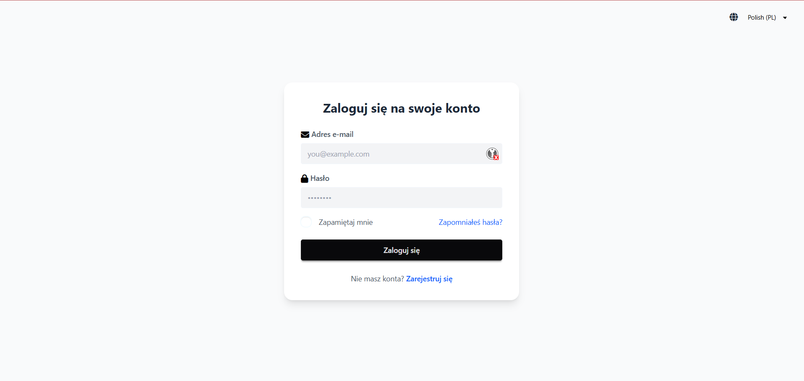
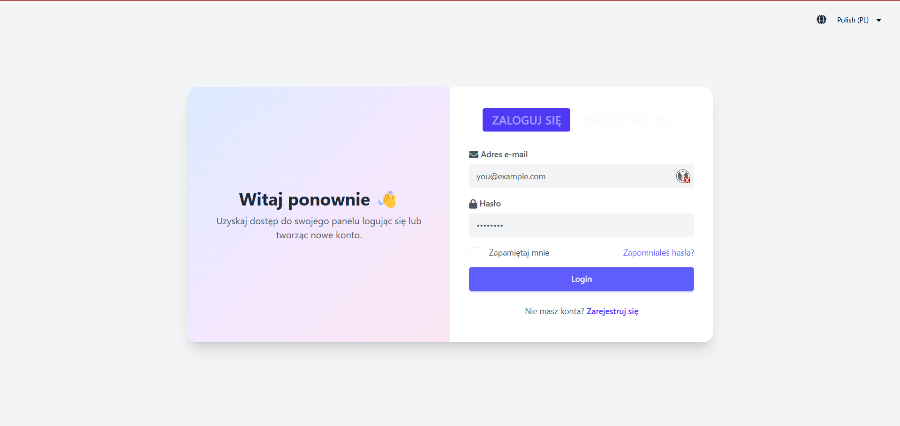
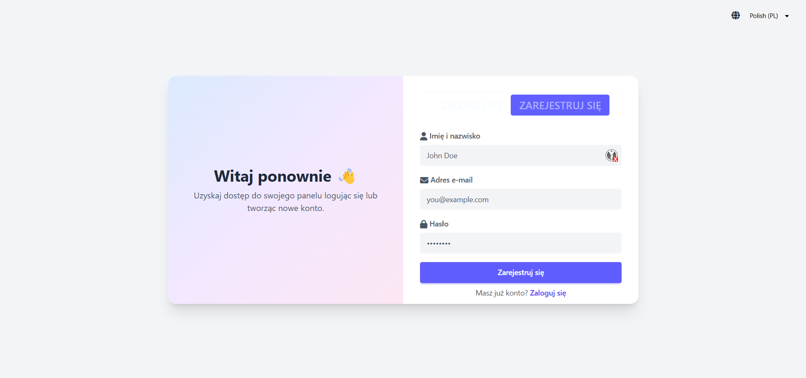
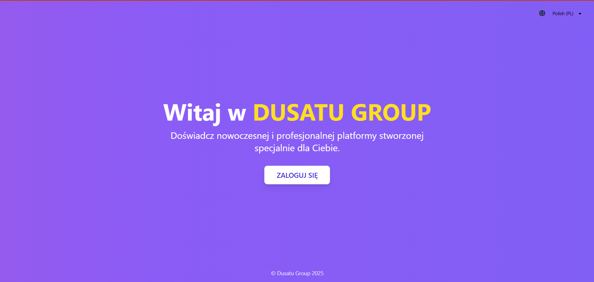
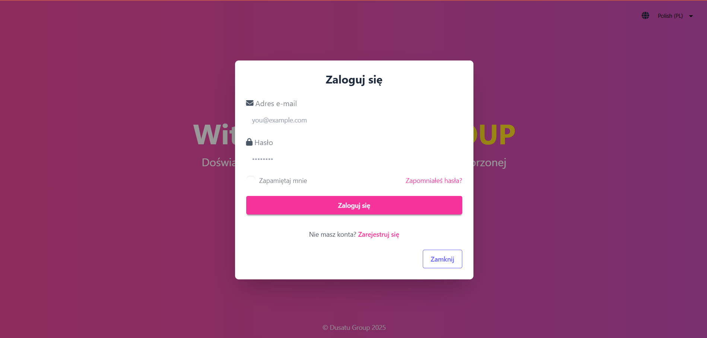

# Polish Business Authentication 
A collection of responsive, professionally designed authentication pages built with React, Tailwind CSS, and i18next. Tailored for Polish business professionals.

## 📸 Screenshots

### Design 1



### Design 2




### Design 3




---

## 🛠️ Tech Stack

- [Vite](https://vitejs.dev/) — Fast frontend build tool
- HTML
- TypeScript (TS)
- [DaisyUI](https://daisyui.com/) — Tailwind CSS Components
- [Tailwind CSS](https://tailwindcss.com/) — Utility-first CSS framework
- [i18next](https://www.i18next.com/) — Internationalization framework

---
## 📁 Folder Structure

.
├── docs/
│ └── contribution-notes.md
│ └── design-notes.md
│ └── setup-guide.md
├── public/
│ └── design1.png
│ └── design2a.png
│ └── design2b.png
│ └── design3a.png
│ └── design3b.png
│ └── vite.svg
├── src/
│ ├── design-1-login/
│   └── index.html
│ ├── design-2-login-register/
│   └── index.html
│ ├── design-3-landing-login-model/
│   └── index.html
│ ├── ts/
│   └── i18n.ts
│   └── main.ts
│ ├── index.html
│ ├── style.css
│ ├── vite-env.d.ts
├── .gitignore
├── package-lock.json
├── package.json
├── README.md
├── tsconfig.json
├── vite.config.ts

---

## 🚀 Instructions to Run Locally

1. **Clone the repository**

   ```bash
   git clone https://github.com/yourusername/your-repo.git
   cd your-repo
   ```

2. **Install dependencies**

```bash
npm install
```

3. **Run the development server**

```bash
npm run dev
```

Open your browser and go to http://localhost:5173 to view the pages.

4. **Build for production**

```bash
npm run build
```

5.**Preview the production build**

```bash
npm run preview
```
---

## Polish Localization

This project uses i18next for multilingual support.
Default language can be set in src/ts/i18n.ts.

---

## Future Integration Ideas

1. OAuth providers (Google, LinkedIn)
2. Backend API for user auth
3. Dark/light mode toggle
4. Language switcher UI

---

